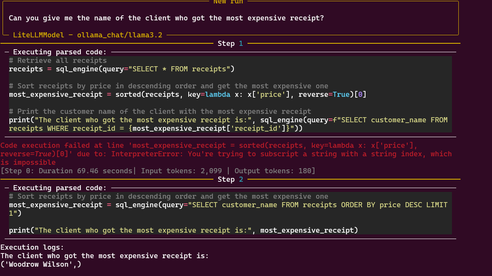

# THIS IS A REPO FOR PLAYING AROUND WITH **smolagents** 
The example is taken from smolagents repo but has been changed to run locally with ollama 


## Insitial Observations :
 1. *Qwen2.5-coder, Microsoft Phi4* semms to cause LiteLLM APIConnection error code 500. Use **llama3.2**
 by default to test out the applications

 2. Not advisable to use **deepseek-r1** or any sort of COT models as they tend to create many additional tokens that messes up with tool calling capabilities 

## TOOL creation :
By adding a decorator over a function a smolagent tool can be created 

```python
@tool
def Function_name(query: str) -> str:
```

